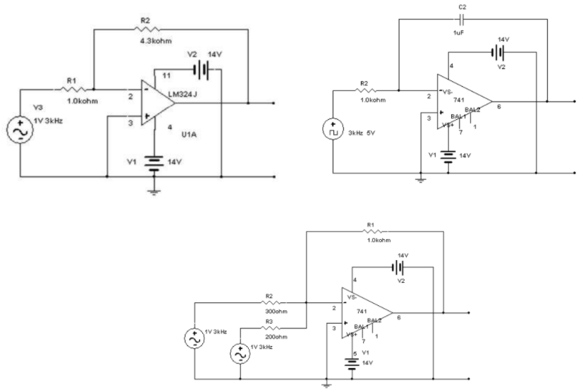
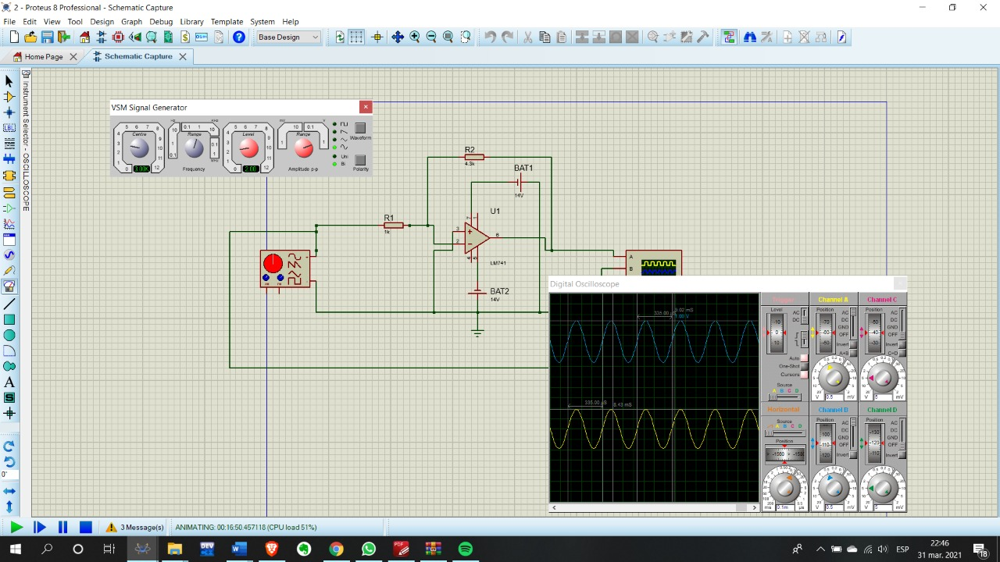
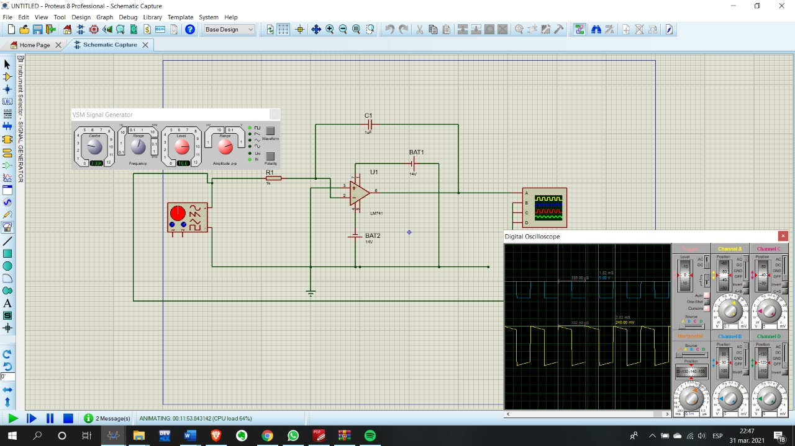
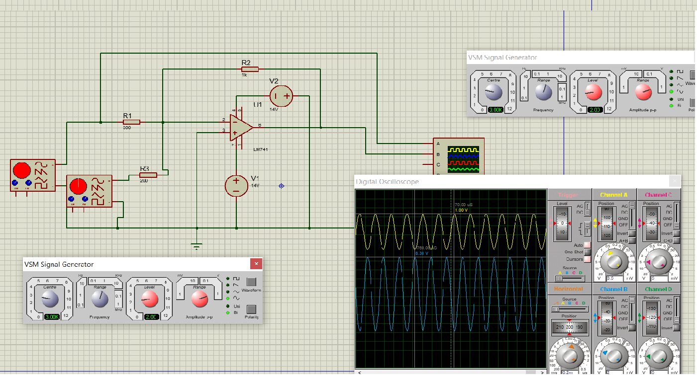

# PRACTICA-No.-9-AMPLIFICADOR-OPERACIONAL
# Informe 

1. OBJETIVOS 

1.1. OBJETIVO GENERAL

- Analizar experimentalmente el comportamiento de un amplificador operacional en un circuit electrico

 1.2. OBJETIVO ESPECIFICO

- Identificar algunas aplicaciones que se pueden llegar a dar con el amplificador
- Analizar el comportamiento del aplificador tanto el un circuito capacitivo como resistivo
- Determinar la señal de entrada y salida con ayuda de un instrumento de medicion 

2. MARCO TEORICO

3. DIAGRAMAS

4. LISTA DE COMPONENTES

- Generador de señales
- Fuente DC
- Osciloscopio
- Protoboard
- Multimetro
- Cables conductores
- Resistencias, capacitores
- Amplificador operacional LM741

5. EXPLICACION 

- Abrimos el simulador que vamos a opucar, en este caso Proteus
- Elegimos los materiales a ocupar
- Armamos el esquema del primer circuito
- Con un osciloscopio capturamos la señal de entrada y salida 
- Repetimos los mismo pasos para los otros 2 circuitos 

5.1 Analice y compare las formas de onda obtenidas en practica con los resultados obtenidos en el trabajo preparatorio. Comente dicha comparacion 

En el primer circuito podemos observar en las gráficas que el voltaje de salida es mucho mayor que el voltaje de entrada, la cual consiste en V3 + VR1, comparando con los demás circuitos se puede observar que si R en paralelo al amplificador es mayor a la resistencia del voltaje de entrada, esto es lo que causa que el voltaje de salida sea mayor.

En el segundo circuito 2, habiendo observado los sucesos del circuito 1, podemos concluir que el voltaje de salida del amplificador va a depender de la resistencia que está en paralelo a éste. Este es un caso especial en la cual esta resistencia es un capacitor, en este caso especial envez de aumentar el voltaje lo que sucede es que el voltaje de salida se convierte en una corriente directa.

Este tercer circuito es muy similar al primer circuito, sin embargo, en este caso se tiene dos voltajes de entrada, ambos con una corriente alterna iguales y dos resistencias distintas, con esto podemos realizar un análisis de nodos y se cumple lo mismo en el circuito 1, de que la resistencia en paralelo con el amplificador es mayor que la resistencia que contribuye voltaje.

5.2 Anote parametros tecnic importantes  de un amplificador operacional que deben ser tomados en cuenta al momento de utilizarlos en un proyecto

-Tensión de alimentación (V+ y V-): Es la tensión de alimentación máxima permitida que puede aplicarse con seguridad al amplificador. Aunque se designa como estándar 15 V de alimentación, la mayoría de los AO integrados operan sobre un amplio rango de potenciales, algunos van desde valores tan bajos como 1 V, y otros hasta 40 V.

-Rango de Temperatura de operación (Tor): Es el rango de temperatura dentro del cual el dispositivo funcionar con las especificaciones mostradas.

-Tensión de entrada diferencial (Vid): Es la tensión máxima que puede aplicarse con seguridad entre los terminales de entrada diferencial sin flujo excesivo de corriente. Estos valores son variables, los AO con entrada cascodo pn p/n pn soportan hasta 30 V, similares a los AO con entrada FET.

5.3 Investigue las caracteristicas de amplificadores operacionales distintos a los utilizados en esta practica 

- TL084

Este amplificador es de alta velocidad , tiene una entrada de alto voltaje y nos proporciona una alta velocidad de respuesta, tiene estras altas de impedancia JFET y un bajo consumo de potencia, cuenta con una baja distorcion armonica.

- Amplificador Operacional Integrador y Diferenciador

La suma de un capacitador al circuito significa que el integrador reacciona a cambios en el voltaje con el tiempo. La magnitud del voltaje de salida cambia, basándose en la cantidad de tiempo que un voltaje gasta apareciendo en la entrada. El diferenciador es lo opuesto a esto. El voltaje producido en el canal de salida es proporcional a la tasa de cambio de la entrada. Los cambios más grandes y rápidos en el voltaje de entrada producirán voltajes de salida más altos.

- Amplificador de instrumentación INA125

Este amplificador se alimenta con 12V, se lo utiliza para el manejo de una celda de carga. La ganancia del INA125 puede ser ajustada mediante un potenciómetro conectado a sus terminales. Toca tomar en cuenta que al cambiar la lontigud de las conexiones o alterar la fuente de alimentación puede desconfigurar la ganancia de este amplificador.

- Amplificador Operacional de Suma y Resta

Estas dos variedades de amplificadores operacionales realizan un proceso aritmético en la señal. Un amplificador operacional de resta saca una señal que es igual a la resta entre sus dos entradas. Un amplificador de suma combina diferentes voltajes de un número de entradas, y saca una ganancia basándose en los voltajes combinados. Cualquiera de estos circuitos puede ser configurado para operar como sistemas inversores o no inversores.

5.4 Investigue otras aplicaciones con circuitos mas complejos que utilizan amplificadores operacionales 

 Se utiliza extensamente en muchos dispositivos, junto con resistores y otros elementos pasivos. Entre las numerosas aplicaciones prácticas se encuentran amplificadores para instrumentos, convertidores digitales-analógicos, computadoras analógicas, cambiadores de nivel, filtros, circuitos de calibración, inversores, sumadores, integradores, diferenciadores, restadores, amplificadores logarítmicos, comparadores, elementos rotatorios, osciladores, rectificadores, reguladores, convertidores de tensión a corriente, convertidores de corriente a tensión y recortadores.

6. CONCLUCION

- Un amplificador operacional actúa de diferente manera, dependiendo de los elementos a las cuales estén conectados, es decir, si existen elementos resistivos, la amplitud de la onda de salida aumenta, pero si está conectado un capacitor, entonces su amplitud cada vez será menor. También depende mucho del tipo de onda de entrada, ya que se derivara o integrara la corriente de salida, en el caso de los cosenos, solo se desplazan 90º, por lo que solo se notara mejor en funciones lineales.
- Una de las utilidades basicas de los amplificadores operacionales son la realizacion de operaciones matematicas en computadores analiticos, las caracteristicas operativas como las sumas, restas, multiplicacion y division.

7. BIBLIOGRAFIA

 Floyd, T. (2007). PRINCIPIOS DE CIRCUITOS ELÉCTRICOS. (8va ed.). México, México: Pearson Education
 
 Alexander, C, & Sadiku, M. (2006). Fundamentos de Circuitos Eléctricos. 3ra. Edición. Mc Graw Hill.
